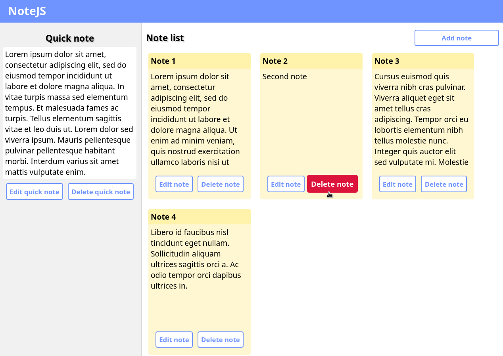
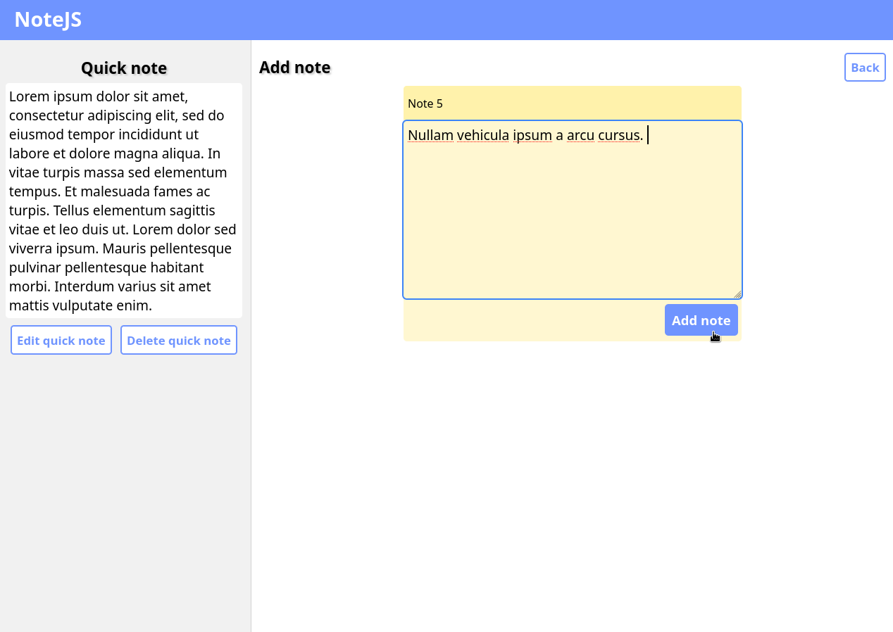
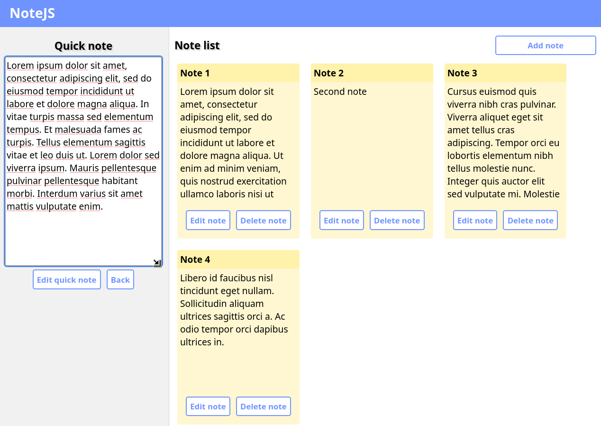
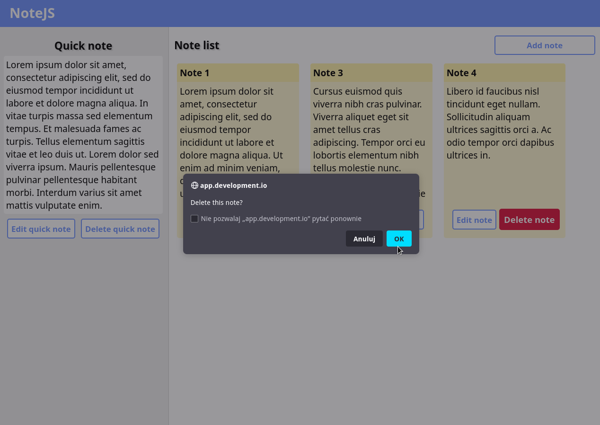
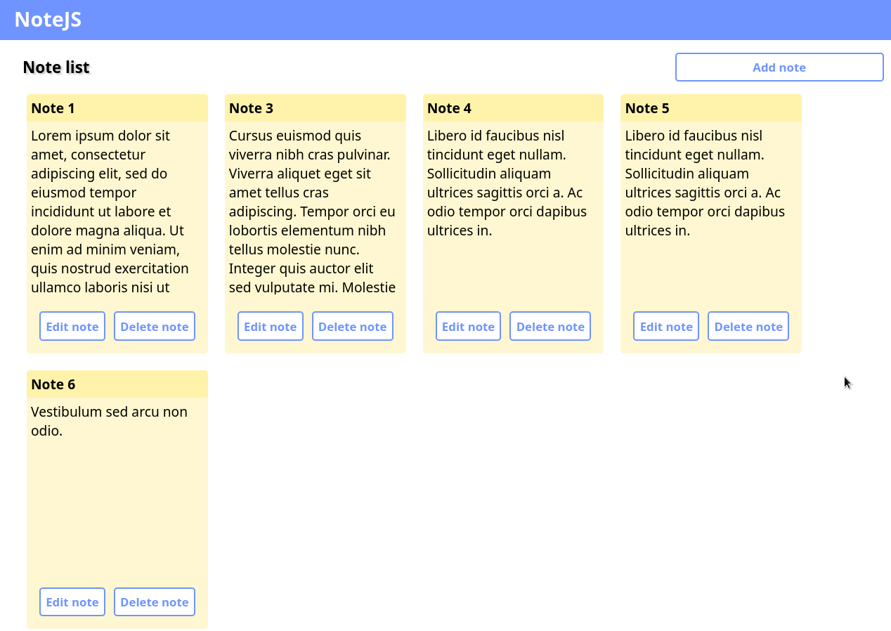
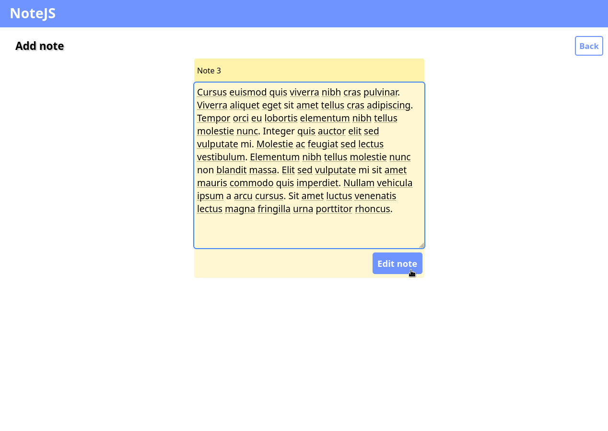
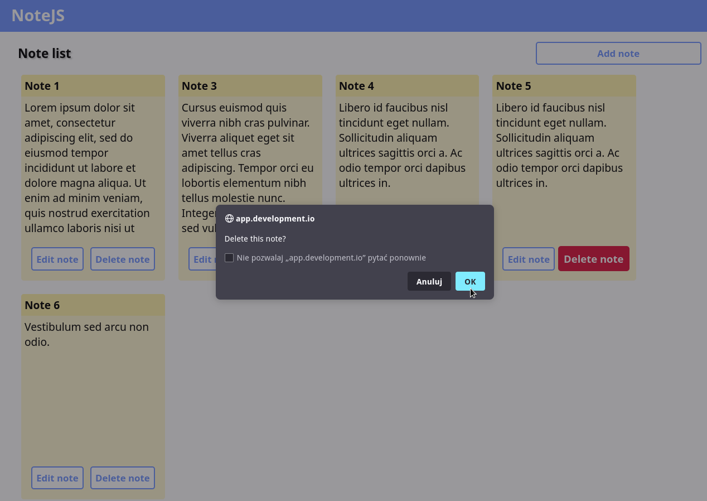
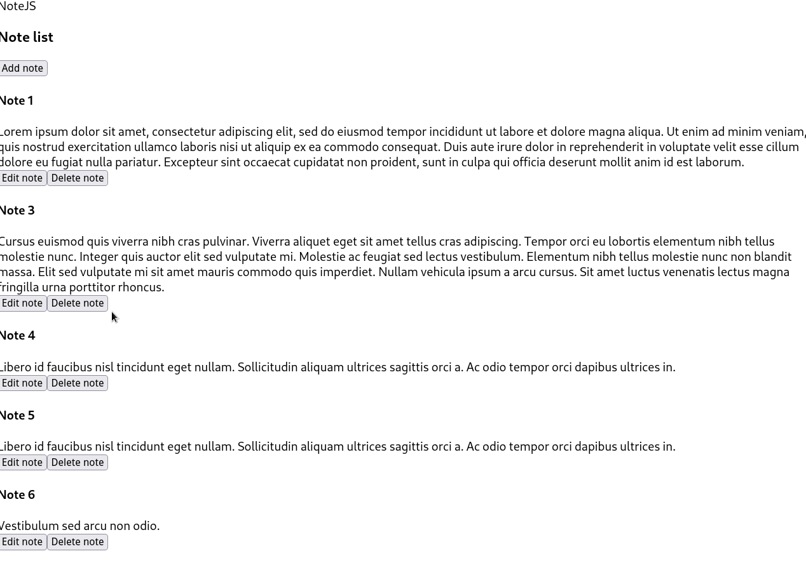

## Kubernetes Project

The application allows you to create, edit and delete notes that are stored in a MongoDB database. In addition, it is possible to create, edit, delete one quick note that is stored in the Redis database. The project has two namespaces development and production, which run independently of each other.

## Project Status

Project completed on 11 June 2022

## Project Screen Shot(s)

#### Frontend - dev-2.0






#### Frontend - dev-1.0





#### Frontend - dev-0.2




## Technologies Used

-   axios
-   cors
-   docker
-   express
-   formik
-   ioredis
-   kubernetes
-   mongoose
-   nodemon
-   prettier
-   react
-   react-dom
-   react-router-dom
-   react-scripts
-   sass
-   yup

## Detailed description

#### Backend

The backend uses an image that has been hosted on DockerHub. Two replicas have been created so that in case of failure or overload the second replica is active all the time. The backend uses two configmaps (my-mongodb-configmap and my-redis-configmap) where the variables needed to connect to the databases correctly are stored. Additionally, a service named my-backend-service (ClusterIP type) has been created to expose a port within the cluster (the service runs on port 5000).

#### Frontend

The frontend uses an image that has also been hosted on DockerHub. As with the backend, two replicas have been created so that in case of failure or overload the second replica is still active. For the frontend, a service named my-frontend-service (ClusterIP type) was created to expose a port within the cluster (the service runs on port 80).

#### MongoDB

The MongoDB database uses a deployment named my-mongodb-deployment. The deployment uses a single replica because the database uses a volume that can be used by one database at a time. A persistent volume is connected to the database under the name pv-mongodb-dev for the development version and pv-mongodb-prod for the production version. Additionally, a persistent volume claim named my-mongodb-pvc has been created. Database data is stored in a container in the `/data/db` folder. Locally the data is stored in the folder `./development/data/mongodb` for the development version, `./production/data/mongodb` for the production version. To expose the port, a service named my-mongodb-service has been created in the cluster area, which exposes the database on port 27017.

#### Redis

The Redis database uses a deployment called my-redis-deployment. The deployment uses a single replica because the database uses a volume that can be used by one database at a time. A persistent volume is connected to the database under the name pv-redis-dev for the development version and pv-redis-prod for the production version. Additionally, a persistent volume claim named my-redis-pvc has been created. In order for the data to write to the folder, the following arguments were set for the database:
`--appendonly yes --save 900 1 --save 30 2`. Data from the database is stored in a container in the `/data` folder. Locally, data is stored in the `./development/data/redis` folder for the development version, `./production/data/redis` for the production version. A service named my-redis-service has been created to expose the port in the cluster area, which exposes the database on port 6379.

#### Ingress

Ingress uses the NGINX Controller to expose the application outside the cluster. The development version of the site is available at [http://app.development.io](http://app.development.io), the production version is available at [http://app.production.io](http://app.production.io). The backend service exposes ports under endpoint /api (uses my-backend-service). The frontend service exposes ports under the endpoint / (uses service my-frontend-service).

## Preparation

1. Before starting the project you need to install NGINX Ingress Controller using the command:

    Windows:

    ```console
    $ kubectl apply -f https://raw.githubusercontent.com/kubernetes/ ingress-nginx/controller-v1.2.0/deploy/static/provider/cloud/ deploy.yaml
    ```

    Linux:

    ```console
    $ kubectl apply -f https://raw.githubusercontent.com/kubernetes/ingress-nginx/controller-v1.2.0/deploy/static/provider/cloud/deploy.yaml
    $ kubectl delete -A ValidatingWebhookConfiguration ingress-nginx-admission
    ```

2. Add the following entry to the `/etc/hosts` file:

    ```
    # Added for TC project
    127.0.0.1 app.development.io
    127.0.0.1 app.production.io
    ```

    Path for Windows:
    `%SystemRoot%system32drivers`.

    Linux path:
    `/etc/hosts`.

3. In the files `./development/volumes/pv-mongodb.yaml`, `./development/volumes/pv-redis.yaml`, `./production/volumes/pv-mongodb.yaml`, `./production/volumes/pv-redis.yaml` you need to set the absolute path in the path variable (appropriate for your operating system).

## Run project

### Development version

Windows:

```console
$ /bin/windows/start-development.bat
```

Linux:

```console
$ ./bin/linux/start-development.sh
```

The application is available at [http://app.development.io](http://app.development.io)

### Production version

Windows:

```console
$ /bin/windows/start-production.bat
```

Linux:

```console
$ ./bin/linux/start-production.sh
```

The application is available at [http://app.production.io](http://app.production.io)

## Stop project

### Development version

Windows:

```console
$ /bin/windows/stop-development.bat
```

Linux:

```console
$ ./bin/linux/stop-development.sh
```

### Production version

Windows:

```console
$ /bin/windows/stop-production.bat
```

Linux:

```console
$ ./bin/linux/stop-production.sh
```

## Operating on project versions

#### Build a new image

```console
$ docker build -t mtx22/backend-project:tag .
$ docker build -t mtx22/frontend-project:tag .
```

#### Add new image to DockerHub

```console
$ docker push mtx22/backend-project:tag
$ docker push mtx22/frontend-project:tag
```

#### Changing the version of the project

To change the version of the project, change the version number (tag) in the my-backend-deployment and/or my-frontend-deployment files at the given image from DockerHub. You can then restart the project using the above startup scripts or use the command:

```console
$ kubectl apply -f my-backend-deployment.yaml
$ kubectl apply -f my-frontend-deployment.yaml
```

To roll back to previous versions of the project you can use the commands below:

-   Print current deployment status

    ```console
    $ kubectl rollout deployment status <deployment_name> -n <namespace>
    ```

-   Prints out the previous versions of the deployment

    ```console
    $ kubectl rollout history deployment <name_deployment> -n <namespace>
    ```

-   Roll back the deployment to the selected version
    ```console
    $ kubectl rollout undo <deployment_name> --to-revision=<deployment_version> -n <namespace>
    ```

#### Available versions of the project

The project has several development and production versions prepared.

##### Frontend versions

-   dev-0.1 - (Development version) allows displaying, adding notes
-   dev-0.2 - (Development version) allows editing, deleting notes
-   dev-1.0 - (Production version) adds styling to notes
-   dev-1.1 - (Developer version) allows displaying, adding quick notes
-   dev-1.2 - (Developer version) allows editing, deleting quick notes
-   dev-2.0 - (Production version) adds styling to quick notes

##### Backend versions

-   dev-0.1 - (Development version) allows connection to MongoDB database
-   dev-0.2 - (Development version) allows basic GET and POST operations on MongoDB database
-   dev-1.0 - (Production version) allows to perform GET, POST, PUT, DELETE operations on MongoDB database
-   dev-1.1 - (Development version) allows connection to Redis database
-   dev-1.2 - (Developer version) allows to perform basic GET and POST operations on Redis database
-   dev-2.0 - (Production version) allows to perform GET, POST, PUT, DELETE operations on Redis database
